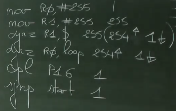
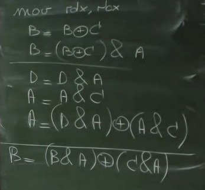

# Zelftest

## Vraag 2
**Waarom is de djnz-instructie een pre-decrementieinstructie? Waarom is een post-instructie hier onmmogelijk?**

*decrement jump not zero*

Je moet eerst de aftrekking doen vooraleer je kan controleren of het resultaat 0 of niet 0 was. Je hebt eerst altijd iets nodig om je statusvlaggen te zetten en vervolgens kan je voorwaardelijke sprong gaan testen op die vlag.

## Vraag 3
**Om de uitvoeringstijd van een stuk code zelf uit te rekenen kan je gebruikmaken van de informatie op pagina 120 en volgende waar je per instructie kan zien hoeveel tijd ze kost om uit te voeren. Bij een voorwaardelijke sprong is dit afhankelijk of de sprong genomen wordt of niet (zie de datasheet voor meer info). De klok bedraagt 24.5 MHz (intern gedeeld door 8), wat is dan de uitvoeringstijd van onderstaand blok code?**

Iets in deze aard heeft een hoge kans om voor te komen op het examen!!

```asm
start:
    mov R0,#255
loop: mov R1,#255
    djnz R1, $
    djnz R0, loop
    cpl P1.6
    sjmp start
```



Vervolgens open je de datasheet (p. 120), bekijk hoeveel cycli iedere instructie duurt en bereken je het. 

*Note: als je de sprong niet moet nemen, duurt je commando 1 klokcyclus minder*

```mov R0,#255```: 2

```mov R1,#255```: 255 * 2 = 510

```djnz R1,$```: 255 * (254 * 3 + 1 * 2) = 194820

```djnz R0,loop```: 254 * 3 + 1 * 2 = 764

```cpl P1.6```: 2

```sjmp start```: 3

Alles samentellen: **196.101** klokcycli heb je nodig om alles uit te voeren.

Om de tijd te berekenen moet je delen door de klokfrequentie.
```LaTeX
(8/24.5)/10⁵ = 0,000000327
0,000000327 * 196101 = 0.06403298
```

Als je wil weten hoe vaak het lampje brand per seconden (1/0.06403298) = 15.6 keer, dus 15 keer.

## Vraag 4
**Leg uitgebreid uit wat er bedoeld wordt met skew.**
*Niet belangrijk*

Komt uitsluitend voor bij paralelle bussen, niet bij seriele.
Wanneer je gebruikmaakt van een volledige poort, en je stuurt iets via die 8 geleiders naar buiten, zal er per definitie altijd een beetje afwijking opzetten. De propagatietijd van je signalen lopen niet allemaal even snel. Je krijgt dus ongewenste effecten, zolang je met KHz/MHz werkt, is er geen probleem, maar zodra je met GHz werkt is er een probleem...

## Vraag 5
**Hoe zou je het onderstaande C-codefragment omzetten naar assembleertaal?**
```c
while ((P1.0 == 0 && P1.7 == 1) || ACC.7 == 0) {
    C = P1.0 & P1.7;
}
```

Je moet deze code opsplitsen in meerdere stukjes, zodat je er code van maakt die je letterlijk kan omzetten naar assembleertaal.

Een logische of zet je onder elkaar. Een logische and zet je de voorwaarden in elkaar.

```c
while(P1.0 == 0) {
    if (P1.7 == 1) {
        C = ...;
    } else {
        break;
    }
}

while (ACC.7 == 0) {
    C = ...;    
}
```

Vervolgens kunnen we dit makkelijk omzetten naar assembleertaal.
```asm
org 0000H

jmp loop

org 0080H

loop:	
	jb P1.0,check_acc
  	jnb P1.7,check_acc
	mov C,P1.0	
	anl C,P1.7 ; C=P1.0&P1.7
	jmp loop
check_acc:
	jb Acc.7,einde
	mov C,P1.0
	anl C,P1.7
	jmp loop
einde:jmp $
```

## Vraag 6
**Wat is isolated I/O en wat is memory mapped I/O? Waar (op welke adressen) worden de I/O-registers van de C8051F120 bewaard? Wat doet de instructie mov SFRPAGE,#0FH precies?** *Niet belangrijk.*

*Memory mapped I/O*: Je intern datageheugen voorziet 256 mogelijke adressen. De minst beduidende 128 adressen worden gebruikt voor je intern data geheugen. En je I/O registers worden gemapt op de 128 meest beduidende adressen van je data geheugen.  (zoals bij de C8051F120)

*Isolated I/O*: Je moet een adressenruimte hebben en een aparte adresruimte, betekenen nieuwe instructies die worden gebruikt om de 2e adresruimte aan te spreken.

## Vraag 7
Implementeer een dubbel looplicht zodat er in de vier meest beduidende bits geroteerd
wordt en in de minst beduidende 4 bit geroteerd wordt. Gebruik P1 om dit te
verwezenlijken. Het verloop is ongeveer het onderstaande. 
```
1 0 0 0 0 0 0 1
0 1 0 0 0 0 1 0
0 0 1 0 0 1 0 0
0 0 0 1 1 0 0 0
0 0 1 0 0 1 0 0
0 1 0 0 0 0 1 0
1 0 0 0 0 0 0 1
```
We kunnen makkelijk zien, dat dit onmogelijk is in 1 implementatie... Daarom zullen we dit opsplitsen in 2 stukken en ze aaneenplakken met een logische OR operator.

```asm
org 0000H

jmp main

org 0080H

main:
	mov R0,#01H  ; 0000 0001
	mov R1,#80H	 ; 1000 0000
loop:
	mov A,R0
	orl A,R1
	cpl A
	mov P1,A

	mov A,R0
	rl A
	mov R0,A

	mov A,R1
	rr A
	mov R1,A
	jmp loop
```

## Vraag 8
**Gegeven onderstaande 80x86-code:**
*Iets in deze aard is de afgelopen 4-5 jaar altijd gevraagd!!*

```asm
mov rdx,rbx
xor rbx,rcx
and rbx,rax
and rdx,rax
and rax,rcx
xor rax,rdx
cmp rax,rbx
```

**Wat zit er in RAX en RBX na het uitvoeren van bovenstaande code?**



Hetzelfde. Omwille van de distributiviteit en communicativiteit van de AND-operatie met de XOR-operatie.

## Vraag 9
**Bereken de onderstaande startwaarden voor een hypothetische 14-bit timer die overloopt van 3FFFH naar 0000H voor de opgegeven tijdsintervallen. Je kan kiezen om optioneel nog eens te delen door 2, 4, 6, 8, 12 of 48. De klokfrequentie waarmee de timer loopt is 50 MHz. Zorg voor zo weinig mogelijk afwijking!**

*Dit kan gevraagd worden!*

Alles moet kleiner zijn dan 2¹⁴ = 16384! Want 14-bit timer.
Startwaarde berekenen doen we door 16384-X te doen. Dan omzetten naar hexadecimaal. X=je uitkomst.

| Tijd |  Startwaarde  | Deling |
|:-----|:--------:|------:|
| **0,5 ms**   | 0F2C  | 2 |
| **70 μs**   | 3254 | / |
| **1,22 ms** | 046E | 4 |

1. (0.5*10⁻³) * 50 * 10⁶ = 25000/2 = 12500
2. (70*10⁻⁶) * 50 * 10⁶ =  3500
3. (1.22*10⁻³) * 50 * 10⁶ = 61000/4 = 15250

## Vraag 10
**Wat is volgens jou het verschil tussen A en ACC en tussen C en CY?**

Je gaat bij hetzelfde geheugenvakje terecht komen, maar A en C zijn symbolen. Acc en Cy heeft een adres terug.

Acc = de accumulator
C, Cy = de carry

Indien adressen nodig gebruik: Acc & Cy
Indien de inhoud nodig: A, C

## Vraag 11
**Waarom zijn bepaalde I/O-registers zoals TCON, P0, P1, ... bitadresseerbaar?**

Als je bijvoorbeeld P0/P1 gebruikt, en je gebruikt enkel een paar bits van P0/P1 dan is het niet de bedoeling dat je de waarden van de andere pinnen (die misschien ook in gebruik zijn) gaat wissen/wijzigen.

Bij TCON heb je bits om je timer te starten, bits om je timer overflow te gaan bekijken, bits om interrupt handling te doen. De bedoeling is niet om via een mov operatie deze bits te gaan aanpassen, daarom moet je dus bitaddreseerbaar werken voor zulke systemen.

## Vraag 12
**Hoe kan je zo efficiënt mogelijk een getal dat zich in de accumulator bevindt delen door 4?**

*Vraag van 2 jaar geleden*

Er is slechts 1 antwoord!

```asm
clr C
rrc A
clr C
rrc A
```

## Vraag 13
**Geef hieronder de verschillende mogelijkheden om op de C8051F120 met één instructie de inhoud van de accumulator op nul te plaatsen ongeacht wat de inhoud vooraf was.**

*Vraag die ooit gesteld is geweest*

```asm
mov A,#0
xrl A,Acc
anl A,0
clr A
djnz Acc,$ ; dit kan maar eigenlijk gebeurt er herhaling... maar "1 instructie"
```

## Vraag 14
**Schrijf een C-programma voor de 80x86 dat op een efficiënte manier de pow-functie implementeert om xy uit te rekenen waarbij x en y van het type unsigned int zijn.Zet dit programma nu letterlijk om naar C8051F120-assembleertaal waarbij je de intsvervangt door bytes.**

De C-functie zal er als volgt uitzien, gebruikmakend van de right shift operator.
```c
#include <stdio.h>

int my_pow(int x, int y) {
    int res = 1;
    int macht = x;
    while(y!=0) {
        if (y%2) {
            res *= macht;
        }
        macht *= macht;
        y >>= 1;
    }
    return res;
}

int main() {
    printf("%d\n", my_pow(23,30));
    return 0;
}
```

Vervolgens zetten we dit om naar assembleertaal.
```asm
org 0000H

jmp main

org 0080H
; x=3 en y=5
main: mov A,#5  ; y=5
      mov R7,#1 ; R7 => Res=1
      mov R6, #3 ; R6 => Macht=3
check:jnz herhaal
      jmp $
herhaal:clr C 
        rrc A ; C=y%2 , A/=2 => y/=2
        jnc verder
        ;C==1
        push ACC
        mov A,R7
        mov B,R6
        mul AB ; na het uitvoeren
               ; A=LSB(product)
               ; B=MSB(product)
        mov R7,A
        pop ACC
verder: push ACC
        mov A,R6
        mov B,R6
        mul AB
        mov R6,A
        pop ACC
        jmp check
```
